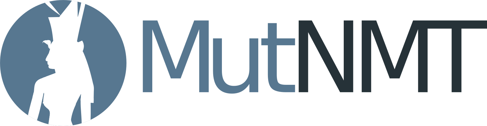

# MutNMT



MutNMT aims to provide a web application to train neural machine translation with didactial purposes. This web application lets the user train, inspect, evaluate and translate using neural engines.

It has been developed by [Prompsit](https://github.com/Prompsit) in collaboration with the partners of the "MultiTraiNMT - Machine Translation training for multilingual citizens" European project (2019-1-ES01-KA203-064245, 01/09/2019–31/08/2022).

This application uses [JoeyNMT](https://github.com/joeynmt/joeynmt) in its core.


## Features

MutNMT provides the following features:

* Upload and manage corpora
    * Upload corpora in text, TMX or TSV format
    * Tag corpora depending on domain
    * Share corpora with other users
* Train and manage engines
    * Select corpora or a subset of those corpora and train a Transformer model
    * Track progress of the training process with data tables and charts
    * Stop, resume or restart training at anytime
* Translate text and documents
    * Select an already trained engine to translate text or documents (HTML, TMX, PDF and Office formats supported)
* Inspect an engine
    * Explore details on tokenization, candidate selection and pre-processed output
* Evaluate translations
    * Upload parallel translation files to evaluate them using BLEU, chrF3, TER and TTR metrics

## Requisites

MutNMT is provided as a [Docker](https://www.docker.com/) container. This container is based on [NVIDIA Container Toolkit](https://github.com/NVIDIA/nvidia-docker).

In order to run MutNMT, you need access to an NVIDIA GPU. You must install the [necessary drivers](https://github.com/NVIDIA/nvidia-docker/wiki/Frequently-Asked-Questions#how-do-i-install-the-nvidia-driver) on the host machine. Note that you do not need to install the CUDA Toolkit on the host system.

## Building MutNMT

The image for the MutNMT container must be built taking into account the following steps.

### Preloaded engines

You can build MutNMT with preloaded engines so that users have something to translate and inspect with. Before building the Docker image, include the engines you want to preload in the `app/preloaded` folder (create it if it does not exist).
Each engine must be stored in its own folder, and must have been trained with [JoeyNMT](https://github.com/joeynmt/joeynmt).
MutNMT will use the `model/train.log` to retrieve information about the engine, so make sure that file is available.

This is an example of an `app/preloaded` tree with one preloaded engine:

```
+ app/
|   + preloaded/
|   |   + transformer-en-es/
|   |   |    - best.ckpt
|   |   |    - config.yaml
|   |   |    - train.model
|   |   |    - train.vocab
|   |   |    - validations.txt
|   |   |    + model/
|   |   |    |    - train.log
|   |   |    |    + tensorboard/
```

### Multiple user account setup

MutNMT provides authentication based on the Google identity server through the OAUTH2 protocol. The procedure of setting such a server in the Google side is a bit complex and Google changes it from time to time, but it can be found [here](https://developers.google.com/identity/protocols/OAuth2UserAgent). Although not official, a useful resource is [this video](https://www.youtube.com/watch?v=A_5zc3DYZfs).

From the process above, you will get at the end two strings, "client ID" and "client secret". You can edit the config.py file in the following way (alternatively, you can create a instance/config.py file with the following content):

```python
SECRET_KEY = 'put a random string here'
DEBUG      = False

USER_LOGIN_ENABLED          = True
USER_WHITELIST_ENABLED      = False
OAUTHLIB_INSECURE_TRANSPORT = True # True also behind firewall,  False -> require HTTPS
GOOGLE_OAUTH_CLIENT_ID      = 'xxxxxxx-xxxxxxxxxxxxxxxxxxxxxxxxx.apps.googleusercontent.com'
GOOGLE_OAUTH_CLIENT_SECRET  = 'xxxxxxxxxxxxxxx'
USE_PROXY_FIX               = False
```

### Admin accounts

To specify admin accounts, please create a file in `app/lists` called `admin.list`, containing one administrator email per line. The admin accounts will allow you to use admin features. You can set as many as you want.

### Whitelist

When user login is not enabled, a whitelist can be established to let the users in that list log in, but only them. This whitelist is only applied when `USER_LOGIN_ENABLED` is set to `False`. To specify a whitelist, create a file in `app/lists` called `white.list`, containing one user email per line. Then, enable the whitelist by setting `USER_WHITELIST_ENABLED` to `True`.

### Working behind a proxy

Google Authentication may fail to work under some scenarios, for example behind an HTTP proxy. Set `USE_PROXY_FIX` to `True` in order to enable [Proxy Fix](https://werkzeug.palletsprojects.com/en/1.0.x/middleware/proxy_fix/) and make authentication work behind a proxy.

### Good to go!

Once you are ready, build MutNMT:

```
docker build -t mutnmt .
```


## Launching the container

The [nvidia-docker](https://github.com/NVIDIA/nvidia-docker) image this container is based on is not compatible with [docker-compose](https://docs.docker.com/compose/). A script to run MutNMT is provided to make launching the container easier:

```
./run.sh cuda 5000 mutnmt:latest
```

This will setup MutNMT to run on port `5000`.

If it is the first time you run MutNMT, make sure to update your database:

```
docker exec mutnmt bash -c "cd /opt/mutnmt/app/ && source ../venv/bin/activate && FLASK_APP=../app flask db upgrade"
```
